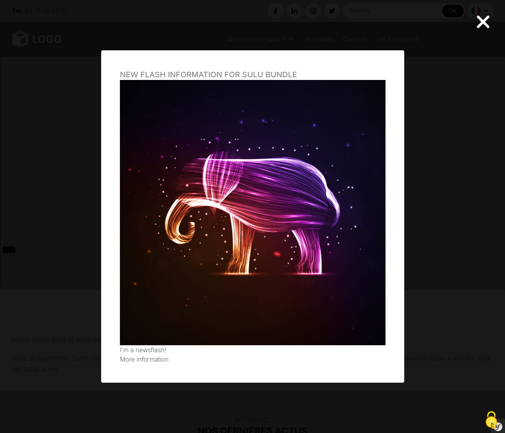
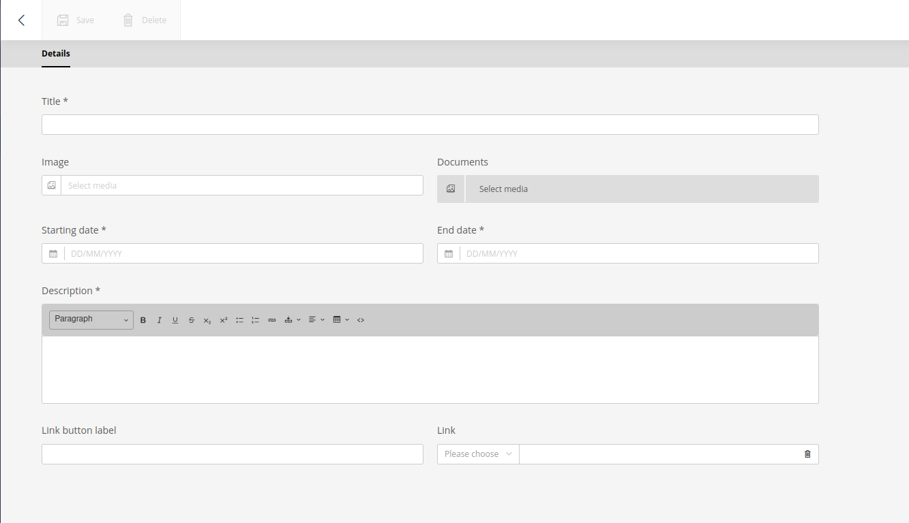
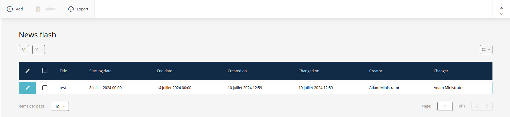
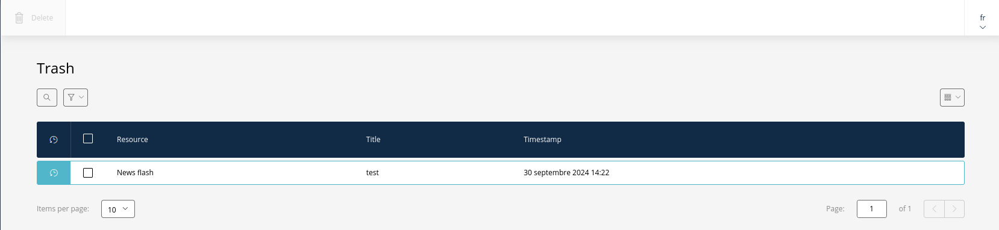
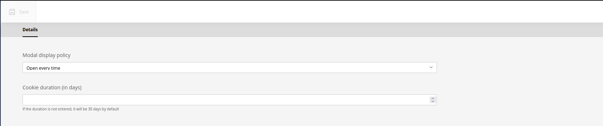

# Sulu Flash Info Bundle


[](https://sulu.io/)

## Presentation

A bundle for the Sulu CMS that allows you to manage flash information displayed with a modal.



## Features

 - program your newsflashes
 - modal in vanilla js (thank you Tingle https://tingle.robinparisi.com/)
 - twig functions to display news flashes

## Requirement

* PHP >= 8.0
* Sulu >= 2.5
* Symfony >= 5.4
* Composer

## Installation

### Install the bundle

Execute the following [composer](https://getcomposer.org/) command to add the bundle to the dependencies of your
project:

```bash
composer require pixelopen/sulu-flashinfobundle
```

### Enable the bundle

Enable the bundle by adding it to the list of registered bundles in the `config/bundles.php` file of your project:

 ```php
 return [
     /* ... */
     Pixel\FlashInfoBundle\FlashInfoBundle::class => ['all' => true],
 ];
 ```

### Update schema

For the development environment:

```shell script
bin/console do:sch:up --force
```

For the production environment: use doctrine migration

## Bundle Config

Define the Admin Api Route in `routes_admin.yaml`
```yaml
flash_info.flash_infos_api:
  type: rest
  prefix: /admin/api
  resource: pixel_flashinfo.flash-infos_route_controller
  name_prefix: flashinfo.

flash_info.setting_api:
  type: rest
  prefix: /admin/api
  resource: pixel_flashinfo.setting_route_controller
  name_prefix: flashinfo.
```

Define the Website Api Route in `routes_website.yaml`
```yaml
flash_infos_auto:
  path: /flash-infos-auto
  controller: Pixel\FlashInfoBundle\Controller\Website\FlashInfoAutoController::flashInfosAuto

flash_infos_click:
  path: /flash-infos-click
  controller: Pixel\FlashInfoBundle\Controller\Website\FlashInfoClickController::flashInfosClick
```

## Use
### Add/Edit a news flash

To add a news flash, go to the "News flash" section and then, click on Add on the top of the page.

Once on the form, fill the following fields:
- Title (mandatory)
- Image
- Documents
- Start date (mandatory)
- End date (mandatory)
- Description (mandatory)
- Button label
- Link



Click on "Save" to save your news flash. To enable it, click on the "Active?" button on the top of the page.

To edit a news flash, click on the pencil of the news flash you wish to edit. This will take you to the same form as the add one.



### Remove/Restore

There are 2 ways to delete a news flash:
- Go the edit form and click on the "Delete" button on the top of the page
- Check the news flash you want to delete and click on "Delete" on the top if the page

In both cases, the deleted news flash will be placed in the trash.

To restore a news flash, go to Settings > Trash and select the news flash you want to restore (by clicking on the reverse clock on the left).
After the restoration, you will be redirected to the edit for.



To permanently delete a news flash, select it and click on the "Delete" button on the top of the page.

### Settings

The settings allow you to set up how the news flash modal should be displayed.
To access it, go to Settings > Newsflash management. You will have two parameters:
- A select which allows you to define if the modal should be opened automatically and how many times. It has the following options:
  - Do not open: the modal is never opened automatically
  - Open once: the modal is open on the first visit of the site (stored in a cookie)
  - Open every time: the modal is opened each time during the user's visit
- A number input that is used to determine the cookie duration. By default, the duration is 30 days



## Display modal

The modal will display the news flashes that are active with the current date in the period defined by the news flash.

The modal can be displayed automatically or by clicking a button.

### Add the automatic modal opening

To use the automatic opening news flash modal, add the auto_display_flash_info_modal function to the head tag.

This function don't take any parameter.

```twig
<head>
    {{ auto_display_flash_info_modal() }}
</head>
```

This Twig function will automatically display the modal according to the modal display policy (set in the settings) if there are published news flashes.

### Add the modal opening on click

To use the modal opening on click, you need to use the display_flash_info_modal_on_click function.

This function must be placed in the head tag and takes one parameter:
- elementId: the id of the element that open the modal

```twig
<head>
    {{ display_flash_info_modal_on_click('flashInfo') }}
</head>
<body>
    <button class="flashInfo">Open the news flashes</button>
</body>
```

This will display the modal no matter what the modal display policy is.

If there is no active news flash, an empty message will be shown.

## Contributing
You can contribute to this bundle. The only thing you must do is respect the coding standard we implement.
You can find them in the `ecs.php` file.
